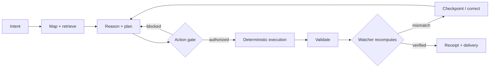
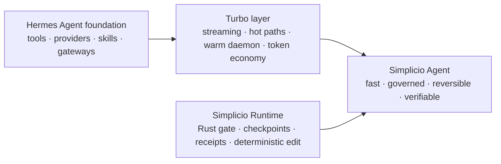
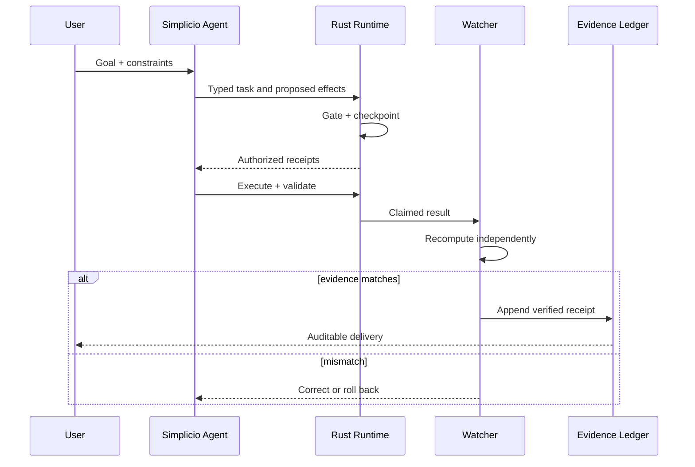
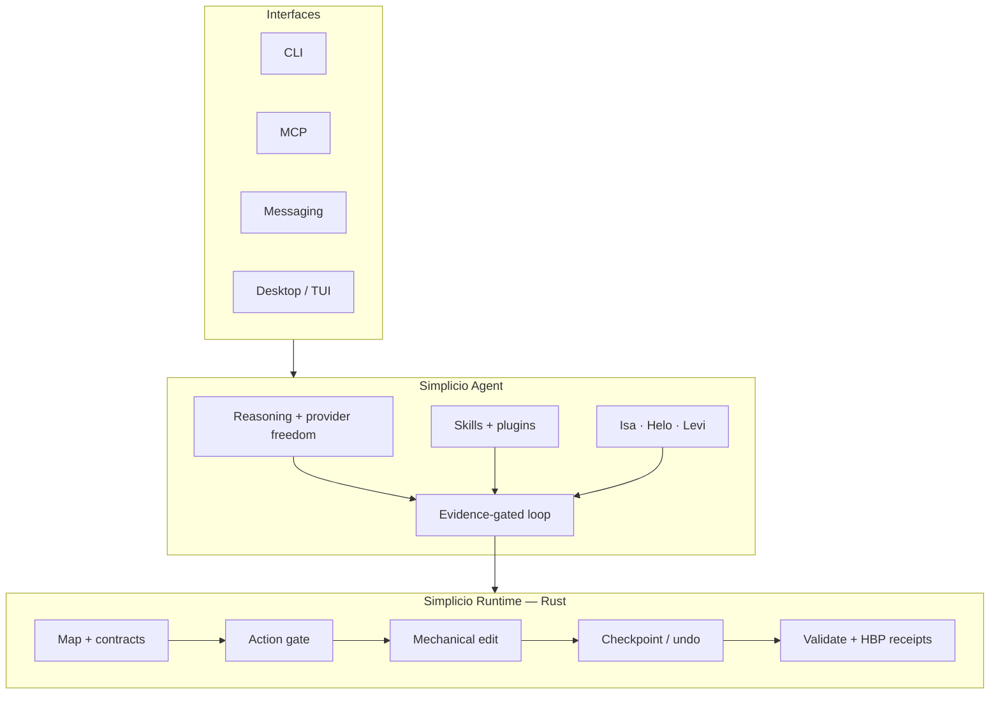

<p align="center">
  
</p>

<h1 align="center">Simplicio Agent</h1>

<p align="center"><strong>Simplicio speed. Simplicio determinism. Verified delivery.</strong></p>

<p align="center">
  The local-first autonomous agent that reasons broadly, executes through a Rust control plane,<br>
  gates every consequential action, and proves the work before it says “done”.
</p>

<p align="center">
  <a href="https://github.com/wesleysimplicio/simplicio-agent/stargazers"></a>
  <a href="https://github.com/wesleysimplicio/simplicio-agent/releases"></a>
  <a href="https://github.com/wesleysimplicio/simplicio-agent/blob/main/LICENSE"></a>
  <a href="https://discord.gg/wM6tr7xVb"></a>
</p>

<p align="center">
  <a href="#why-simplicio">Why Simplicio</a> ·
  <a href="#simplicio-vs-official-hermes-agent">vs Hermes</a> ·
  <a href="#architecture">Architecture</a> ·
  <a href="#quick-install">Install</a> ·
  <a href="#star-history">Star History</a>
</p>

<p align="center">
  <strong>🌍 Languages</strong><br>
  <a href="README.md">🇬🇧 English</a> |
  <a href="READMEs/README.pt-BR.md">🇧🇷 Português</a> |
  <a href="READMEs/README.es-ES.md">🇪🇸 Español</a> |
  <a href="READMEs/README.fr-FR.md">🇫🇷 Français</a> |
  <a href="READMEs/README.de-DE.md">🇩🇪 Deutsch</a> |
  <a href="READMEs/README.it-IT.md">🇮🇹 Italiano</a> |
  <a href="READMEs/README.ja-JP.md">🇯🇵 日本語</a> |
  <a href="READMEs/README.ko-KR.md">🇰🇷 한국어</a> |
  <a href="READMEs/README.zh-CN.md">🇨🇳 简体中文</a> |
  <a href="READMEs/README.ru-RU.md">🇷🇺 Русский</a> |
  <a href="READMEs/README.pl-PL.md">🇵🇱 Polski</a> |
  <a href="READMEs/README.tr-TR.md">🇹🇷 Türkçe</a> |
  <a href="READMEs/README.nl-NL.md">🇳🇱 Nederlands</a> |
  <a href="READMEs/README.hi-IN.md">🇮🇳 हिन्दी</a> |
  <a href="READMEs/README.ar-SA.md">🇸🇦 العربية</a>
</p>

---

## Why Simplicio

Most agents optimize the conversation. Simplicio optimizes the **entire delivery path**.

| Pillar | What Simplicio adds | Why it matters |
|---|---|---|
| ⚡ **Speed** | Streaming, fast JSON/serde paths, lazy schemas, warm daemon, deterministic routing, token-aware working set | Less waiting and less context waste |
| 🛡️ **Determinism** | Compiled Rust runtime, action gate, mechanical edits, checkpoints and undo | The model proposes; the runtime controls effects |
| ✅ **Proof** | HBP evidence chain, watcher recomputation, receipts, progressive validation and delivery gates | “Done” becomes auditable evidence, not a sentence |
| 🧠 **Memory** | Project guardian, runtime guardian, durable attempts, skill memory and local retrieval | The agent reuses what worked and avoids oscillation |
| 🌐 **Reach** | CLI, MCP, desktop, messaging gateways, plugins, skills and model/provider freedom | One governed agent across the surfaces you already use |
| 🏠 **Ownership** | Local-first execution, local model ladder and user-owned state | Your machine, your data, your rules |



## Hermes → Simplicio Agent

<p align="center">
  
</p>

Simplicio Agent is an independent, public fork of [NousResearch/hermes-agent](https://github.com/NousResearch/hermes-agent). It keeps the upstream strengths—broad tools, provider choice, skills, messaging, learning and fast interaction—then evolves the execution model around the Simplicio Runtime.

This is **inheritance plus evolution**: Hermes remains the origin and receives attribution; Simplicio is the product identity, control plane and delivery contract.



## Simplicio vs official Hermes Agent

Comparison snapshot: **15 July 2026**, against the public `main` branch of [official Hermes Agent](https://github.com/NousResearch/hermes-agent). “Simplicio advantage” means a capability present and documented in this repository; it does not imply that Hermes is weak or unsuitable for its own goals.

### Measured shared hot paths

Reproduce with `python3 scripts/benchmark_vs_upstream.py --upstream ../hermes-agent`. Methodology and limits are documented in [`docs/performance.md`](docs/performance.md).

| Shared probe | Simplicio Agent | Official Hermes | Measured gain |
|---|---:|---:|---:|
| JSON encode, tool result | 2.8 µs | 33.1 µs | **12.0×** |
| JSON decode, tool args | 0.6 µs | 1.8 µs | **3.1×** |
| Canonicalize tool args | 1.2 µs | 5.2 µs | **4.5×** |
| Token estimate, 200 messages | 634 µs | 677 µs | **1.07×** |
| CLI cold import | 66.4 ms | 117.6 ms | **1.77×** |

> These are focused microbenchmarks captured on Linux/Python 3.11, not a claim that every end-to-end task is 12× faster. Run the benchmark on your hardware.

### Difference-by-difference

| Area | Official Hermes Agent | Simplicio Agent advantage |
|---|---|---|
| Product core | Python agent runtime | Hermes-derived agent fused with the compiled Simplicio Rust control plane |
| Canonical CLI | `hermes` | `simplicio-agent`; `hermes` remains a deprecated compatibility alias |
| Effect control | Tool/runtime policies | Unified mutation classification and fail-closed action gate |
| Mechanical changes | Model/tool-written operations | Zero-token deterministic edit plans when the change is mechanical |
| Recovery | Task-specific retries | Checkpoints, undo paths and transaction-aware recovery |
| Completion | Agent decides it is finished | Evidence-gated loop plus independent watcher recomputation |
| Evidence | Logs and tool results | Typed receipts plus append-only HBP evidence lineage |
| Performance posture | General-purpose defaults | Fast installers enable serde, fast JSON and uvloop by default |
| JSON/serialization | Standard shared path | `orjson`/`msgspec` fast path with pure-Python fallback |
| Native hot paths | Python-first | Optional PyO3 hot path plus compiled Rust execution kernel |
| Startup | Standard CLI lifecycle | Lazy boot path plus optional warm daemon |
| Context economy | Compression and memory | Working-set LRU, cold references, TF-IDF scoring, token cache and prefetch |
| Tool output economy | Normal tool payloads | TOON boundary and token-saver compaction with telemetry |
| Routing | Model/tool routing | Deterministic no-LLM route first, then local/remote escalation ladder |
| Repository context | Agent reads tools/files | Runtime map + mapper + zero-copy orientation pack |
| Runtime knowledge | Loaded instructions | Helo guardian ranks runtime capabilities and mutation paths |
| Project knowledge | Conversation/project memory | Isa guardian ranks project docs, examples and local memory |
| External discovery | Web tools when selected | Levi is explicitly gated: external lookup only after local guardians miss |
| Parallel work | Subagents and tool concurrency | Governed fan-out, leases, worktree isolation, backpressure and receipts |
| Orchestration | Agent loop | Bounded `simplicio-loop` with converge/drain modes and anti-oscillation journal |
| Self-modification | General development workflow | Explicit self-mutation isolation, promotion and handoff contract |
| Validation | Tests selected by workflow | Progressive validation, watcher gate, DoD and delivery certificate surfaces |
| Observability | Logs, sessions and integrations | Stage timers, token savings, lane readiness, receipts and runtime status |
| Local execution | Supports local and remote models | Local-first decision ladder with governed shared inference pool |
| Contracts | Tool/API conventions | Versioned `simplicio.* /v1` envelopes across task, progress, effects and evidence |
| Safety at scale | Host/tool safeguards | CPU, disk, queue, timeout, iteration and “never explode” caps |
| Compatibility | Upstream ecosystem | Keeps upstream capabilities while migrating toward native Simplicio identity |

## Verified execution, not performative autonomy

<p align="center">
  
</p>

Every consequential run follows a bounded path. Authorization is separated from possibility; evidence is part of execution; rollback is designed in rather than improvised afterward.



## Architecture



The narrow waist is intentional: the model reasons and coordinates; the runtime owns deterministic effects, evidence and recovery.

## Quick install

### macOS, Linux, WSL2 and Termux

```bash
curl -fsSL https://simpleti.com.br/simplicio/install.sh | sh
simplicio-agent setup
simplicio-agent doctor
```

### From source

```bash
git clone https://github.com/wesleysimplicio/simplicio-agent.git
cd simplicio-agent
python3 -m venv .venv
source .venv/bin/activate
pip install -e ".[fast]"
simplicio-agent setup
```

The `hermes` command remains available temporarily for compatibility, but new automation should use `simplicio-agent`.

## Start here

```bash
# Interactive agent
simplicio-agent

# Diagnose the fast stack and Runtime binding
simplicio-agent doctor

# Inspect the Runtime's live capability contract
simplicio runtime map --for-llm markdown --repo .
```

Useful references:

- [`docs/SIMPLICIO_OPERATIONAL_MANUAL.md`](docs/SIMPLICIO_OPERATIONAL_MANUAL.md) — execution and safety model
- [`docs/performance.md`](docs/performance.md) — benchmark methods and reproducible numbers
- [`docs/SIMPLICIO_AGENT_CAPABILITY_CONTRACT.md`](docs/SIMPLICIO_AGENT_CAPABILITY_CONTRACT.md) — capability inventory
- [`docs/architecture/INDEX.md`](docs/architecture/INDEX.md) — architectural decisions
- [`CONTRIBUTING.md`](CONTRIBUTING.md) — contribution guide
- [`SECURITY.md`](SECURITY.md) — security policy

## Star History

<a href="https://star-history.com/#wesleysimplicio/simplicio-agent&Date">
  <picture>
    <source media="(prefers-color-scheme: dark)" srcset="https://api.star-history.com/svg?repos=wesleysimplicio/simplicio-agent&type=Date&theme=dark" />
    <source media="(prefers-color-scheme: light)" srcset="https://api.star-history.com/svg?repos=wesleysimplicio/simplicio-agent&type=Date" />
    
  </picture>
</a>

## Lineage, license and community

Simplicio Agent is licensed under the [MIT License](LICENSE) and derives from the excellent work of [Nous Research](https://nousresearch.com) and the [Hermes Agent contributors](https://github.com/NousResearch/hermes-agent/graphs/contributors). See the repository history and license notices for attribution.

- ⭐ Star this repository if verified, local-first autonomy is the direction you want.
- 💬 Join the [Simplicio Discord](https://discord.gg/wM6tr7xVb).
- 🐛 Open an [issue](https://github.com/wesleysimplicio/simplicio-agent/issues) with a reproducible case.
- 🔧 Send a focused PR with tests and evidence.

<p align="center"><strong>Simplicio Agent — possibility is cheap; action is gated; completion is proved.</strong></p>
