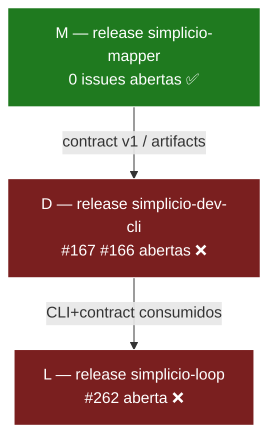

# Release DAG — Simplicio Ecosystem

Ordem canônica de release (definida por Wesley): **mapper → dev-cli → loop**.
Não misturar merges/releases fora dessa dependência.

## Estado (MEDIDO via `gh issue list`, 2026-07-12)

| Nó | Repo | Depende de | Issues abertas | Gate de release |
|----|------|-----------|----------------|-----------------|
| M  | simplicio-mapper  | —         | 0 ✅  | ABERTO |
| D  | simplicio-dev-cli | M         | #167, #166 ❌ | BLOQUEADO |
| L  | simplicio-loop    | D         | #262 ❌ | BLOQUEADO |

## DAG (mermaid)

## Sequência de execução (quando destravada)

1. **M** — tag/release do mapper (pronto, 0 open).
2. **D** — só após M: fechar #167 + #166, depois release dev-cli.
3. **L** — só após D: fechar #262, depois release loop.

## Gap que bloqueia a liberação

- dev-cli #167 [P0] Ecosystem Rebrand — Dev CLI usa Simplicio Agent em bootstraps, descriptors, locales e contracts
- dev-cli #166 [P0] Plan Compiler — Goal + ContextSnapshot → PlanDAG tipado, effect-free e verificável
- loop #262 [P0] Ecosystem Rebrand — Adapter Hermes → simplicio_agent com shim, contracts e clean-install gate

Ação para destravar: drenar essas 3 issues (wave por menor backlog: loop #262 → dev-cli #167/#166), então executar a DAG M→D→L.
